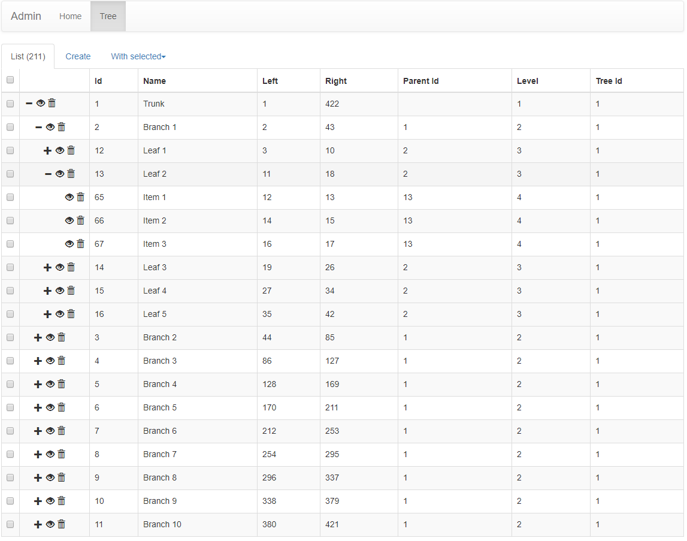

flask-admin 树状表格示例
#############################

快速开始
*********

::

    git clone git@github.com:AngelLiang/flask-admin-tree-table-demo.git
    cd flask-admin-tree-table-demo

    pipenv install
    pipenv shell
    python app.py

启动后访问： http://127.0.0.1:5000/admin/tree/

效果图
*******

主要依赖
********

- jquery-treegrid.js: 用于显示树状表格
- sqlalchemy-mptt: 配置数据模型为“左右值树”数据结构

说明
*****

本示例前端树形表格依赖 jquery-treegrid.js 插件；后端树状数据模型需要设计成“左右值树”数据结构，因此 Tree 模型引用了 sqlalchemy_mptt 扩展。

移植说明
========

一、设计数据结构

首先树状数据模型需要设计成左右值数据结构，本示例直接使用 sqlalchemy_mptt 扩展。

.. code:: python

    from sqlalchemy_mptt.mixins import BaseNestedSets
    from flask_sqlalchemy import SQLAlchemy

    db = SQLAlchemy()

    class Tree(db.Model, BaseNestedSets):
        __tablename__ = 'tree'

        id = db.Column(db.Integer, primary_key=True)
        name = db.Column(db.String(64))

二、配置 flask-admin 的 ModelView

然后配置 TreeView

.. code:: python

    from flask_admin.contrib.sqla import ModelView

    class TreeTableConfigMixin(object):
        """树形表格专用配置混入类"""
        # 设置 list_template
        list_template = 'admin/model/tree_table.html'

        # 禁止分页，直接获取该数据表所有数据
        page_size = None

        # 禁止设置每页显示的数量
        can_set_page_size = False

        # 禁止任何字段的排序，以免干扰 treegrid.js 显示正确的数据顺序
        column_sortable_list = []

        # 默认以 left 字段排序，使 treegrid.js 能正确显示树形表格
        column_default_sort = 'left'

    class TreeView(TreeTableConfigMixin, ModelView):
        """
        注意 TreeTableConfigMixin 要放在 ModelView 前面
        """
        pass

三、移植模板和静态文件

把 static 和 templates 里的文件拷贝到相关目录下，另外稍微注意一下 ``templates/admin/model/tree_table.html`` 文件里面引用的 css 和 js 文件路径即可。

四、完成

至此主要的移植步骤已经完成，如果还有问题则根据实际情况调整一下代码。
